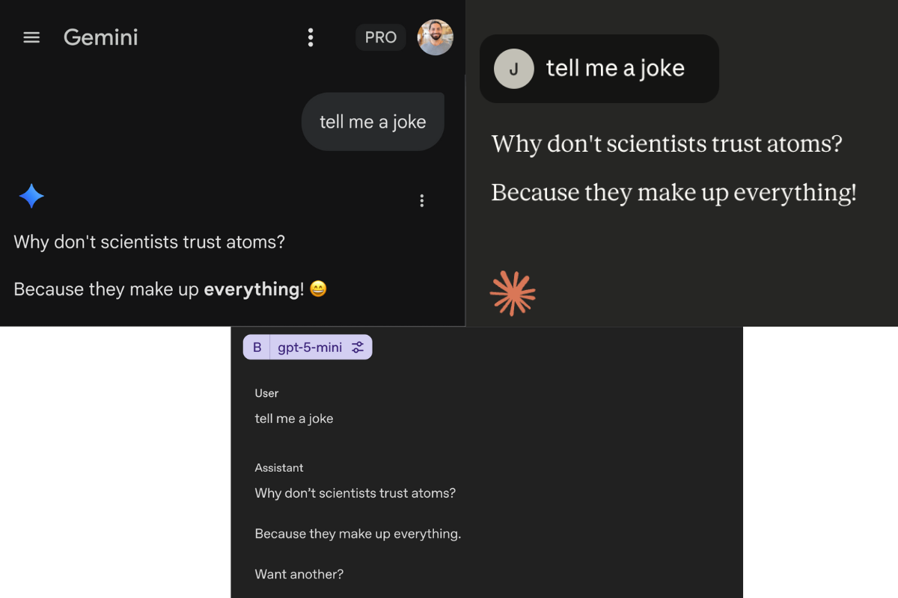
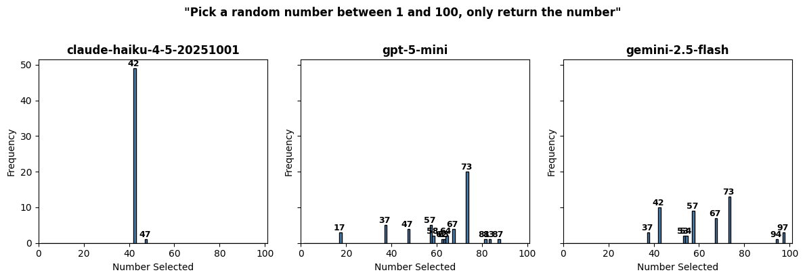

If you ask claude, gemini and gpt to tell you a joke, they are all very likely to tell you the same joke:

> Why don't scientists trust atoms? Because they make up everything!



It's not a terrible joke per se, but what is surprising is that all big lab models are very likely to tell you this joke.

Let's use the API and ask each provider to tell us a joke 3 different times: 

```
models = [
    "claude-haiku-4-5-20251001",
    "gpt-5-mini",
    "gemini-2.5-flash",
]

prompt="Tell me a joke"
```

<details>

<summary>See all outputs from "Tell me a joke" experiment</summary>


```
claude-haiku-4-5-20251001
==================================================
**************************************************
Why don't scientists trust atoms?

Because they make up everything! 😄
**************************************************
**************************************************
Why don't scientists trust atoms?

Because they make up everything! 😄
**************************************************
**************************************************
Why don't scientists trust atoms?

Because they make up everything! 😄
**************************************************
gpt-5-mini
==================================================
**************************************************
Why don't scientists trust atoms? Because they make up everything.

Want another (a pun, dark, or tech one)?
**************************************************
**************************************************
Why don't scientists trust atoms?

Because they make up everything.

Want another (dad joke, programmer joke, or dark humor — within safe limits)?
**************************************************
**************************************************
Why did the scarecrow win an award?

Because he was outstanding in his field.

Want another?
**************************************************
gemini/gemini-2.5-flash
==================================================
**************************************************
Why don't scientists trust atoms?

Because they make up everything! 😁
**************************************************
**************************************************
Why don't scientists trust atoms?

Because they make up everything!
**************************************************
**************************************************
Why don't scientists trust atoms?

Because they make up everything!
**************************************************
```
</details>

<br>

Long story short, top 3 big lab models, asked 3x times for a joke (total of 9 possibilities), came up collectively with a total of 2 unique jokes. 

My experiments are not terribly scientific, but they are telling of a trend - these models are all converging to the same responses.

## More similarities?

<details>

<summary>"Pick a random fruit, only return the fruit"</summary>

Outputs:

```
claude-haiku-4-5-20251001
==================================================
**************************************************
Mango
**************************************************
**************************************************
Mango
**************************************************
**************************************************
Apple
**************************************************
**************************************************
Mango
**************************************************
**************************************************
Mango
**************************************************
gpt-5-mini
==================================================
**************************************************
Mango
**************************************************
**************************************************
Mango
**************************************************
**************************************************
Mango
**************************************************
**************************************************
Mango
**************************************************
**************************************************
Mango
**************************************************
gemini/gemini-2.5-flash
==================================================
**************************************************
Apple
**************************************************
**************************************************
Apple
**************************************************
**************************************************
Apple
**************************************************
**************************************************
Mango
**************************************************
**************************************************
Apple
**************************************************
```
</details>

<br>

<details>

<summary>"Pick a random colour, only return the colour"</summary>

Outputs:

```
claude-haiku-4-5-20251001
==================================================
**************************************************
Turquoise
**************************************************
**************************************************
Teal
**************************************************
**************************************************
Teal
**************************************************
**************************************************
Teal
**************************************************
**************************************************
Teal
**************************************************
gpt-5-mini
==================================================
**************************************************
Teal
**************************************************
**************************************************
teal
**************************************************
**************************************************
magenta
**************************************************
**************************************************
Turquoise
**************************************************
**************************************************
teal
**************************************************
gemini/gemini-2.5-flash
==================================================
**************************************************
Blue
**************************************************
**************************************************
Blue
**************************************************
**************************************************
Blue
**************************************************
**************************************************
Red
**************************************************
**************************************************
Blue
**************************************************
```
</details>

<br>

Out of a total of 15 different runs (5x per model), only 2 distinct fruits were picked: "Apple" and "Mango". 

For colours, almost all of them are shades of blue, with a lot of "turquoise" and "teal" being selected.

How about selecting "random" numbers?

```"Pick a random number between 1 and 100, only return the number"```

Not surprisingly, they are not doing so good either. Here I ran the same prompt 50x per model:



We get a huge disproportionate amount for 42 (I guess somewhat obvious), but also a disproportionate amount of 73 and 57.

## What's going on

We've all been told LLMs are stochastic parrots trained on the entire internet from scratch. 
You'd expect each training run to produce entirely different results - especially for models with different architectures. 

So what's going on? I'm not sure but I have a few ideas.

- Benchmaxxing and overfitting on the same preference datasets could lead to similar biases
- Big model companies use similar data providers
- Maybe some model companies distill on each others' models?

One thing is certain, if all models start outputing the same things over and over, we risk finding ourselves seeing the same bland ideas regurgitated over and over.

I really hope models of the future end up having more distinct personalities and don't end up being different shades of beige.
